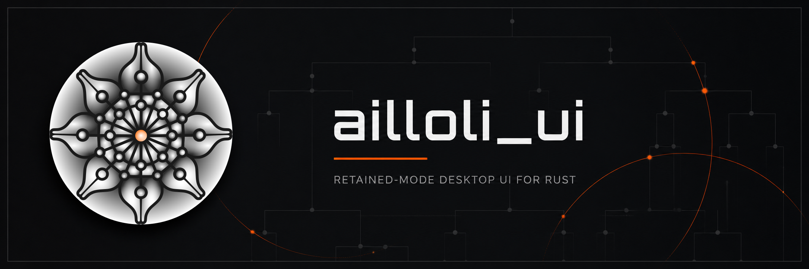

# Ailloli UI

[](https://github.com/AilloliAI/ailloli_ui/actions/workflows/ci.yml)
[](https://crates.io/crates/ailloli_ui)
[](https://docs.rs/ailloli_ui)

Ailloli UI is a retained-mode desktop UI framework for Rust, built for native
applications that need predictable state, targeted updates, and GPU-accelerated
rendering.

It combines a backend-neutral retained runtime with native `winit` windows, a
primary `wgpu` renderer, and reusable components for building complete desktop
applications.

> **Status:** Ailloli UI is pre-1.0 and under active development.\
> **Release candidate:** `0.1.0-beta.2` was frozen on 2026-09-03.\
> **MSRV:** Rust 1.88\
> Confirm that beta.2 is present on crates.io before using the registry
> installation below.

[API Documentation](https://ailloliai.github.io/ailloli_ui/) ·
[0.1.0-beta.2 release notes](https://github.com/AilloliAI/ailloli_ui/blob/main/CHANGELOG.md) ·
[Contributing](CONTRIBUTING.md) · [Support](SUPPORT.md) ·
[Security](SECURITY.md)

## Features

- Retained-mode UI with targeted build, layout, and paint invalidation
- Native desktop windows powered by `winit`
- GPU rendering through `wgpu`
- Backend-neutral runtime and rendering architecture
- Layouts, controls, text editing, file and terminal widgets
- Code-editor primitives with optional Tree-sitter integration
- Provider-neutral filesystem architecture
- Runtime inspection through optional DevTools
- Experimental Vulkan and OpenXR integration

## Quick start

After crates.io lists beta.2, add the façade crate:

```toml
[dependencies]
ailloli_ui = "0.1.0-beta.2"
```

Then build an application through the public prelude:

```rust
use ailloli_ui::prelude::*;

fn main() -> ailloli_ui::Result<()> {
    let headline = State::new(
        "Build native Rust interfaces".to_string(),
    );
    let preview = headline.clone();

    App::new()
        .window(
            Window::new("main")
                .title("Hello")
                .size(800.0, 600.0)
                .ailloli_ui_chrome()
                .content(move || {
                    Column::new()
                        .padding(16.0)
                        .gap(12.0)
                        .child(TextInput::<()>::new().bind(headline.clone()))
                        .child(Text::new(preview.clone()).size(24.0))
                }),
        )
        .run()
}
```

`ailloli_ui::prelude::*` is the primary application API.

Lower-level crates remain available for custom runtimes, render hosts, platform
integrations, and reusable framework extensions.

## Beta 2 highlights

Beta.2 focuses on retained consistency and interactive scrolling:

- reactive reads now invalidate the exact retained Build, Layout, or Paint
  consumers, including consumers mounted in separate native presentations;
- layout publishes geometry, caches, and reactive dependencies atomically, and
  paint never redraws fresh content into stale bounds;
- scroll views, editors, text inputs, tables, terminals, and popup lists share
  wheel normalization, scrollbar geometry, track clicks, and captured dragging;
- `Dialog::modal_content` composes retained modal content, while
  `Dialog::on_submit` provides an Enter fallback after descendants receive the
  event;
- `Component` accepts capturing render closures, and custom widget authors can
  inspect `LayoutPass` and the public scrollbar geometry primitives.

The audited beta.1 to beta.2 delta does not remove or rename a documented
façade item, so documented beta.1 consumers require no source migration. APIs
remain pre-1.0 and may evolve in later betas. Vulkan and OpenXR remain
experimental; this candidate is validated by the public Linux and Windows CI
paths, not by macOS or OpenXR hardware testing.

Read the complete [0.1.0-beta.2 release notes](https://github.com/AilloliAI/ailloli_ui/blob/main/CHANGELOG.md)
and the latest-beta [security support policy](SECURITY.md).

## Architecture

Ailloli UI separates the public application API, retained runtime, platform
integration, and rendering layers.

```text
Application
    │
    ▼
ailloli_ui
    │
    ├── Core
    ├── Runtime
    ├── Widgets
    ├── Text / Editor
    ├── Files / Terminal
    └── DevTools
    │
    ▼
Platform host (`winit`)
    │
    ▼
Renderer (`wgpu`)
    │
    ├── Vulkan (experimental)
    └── OpenXR (optional)
```

The dependency direction is intentionally one-way: framework crates never
depend on consumer applications or application-owned business logic.

Ailloli UI uses targeted retained work so changes can invalidate build, layout,
or paint independently without forcing unrelated stable components to be
rebuilt.

### Reactive consistency

Retained build, layout, and paint callbacks automatically subscribe to the
reactive sources they actually read. Dependencies are replaced only after a
callback succeeds, so conditional reads stop obsolete work without exposing a
partially updated dependency graph.

Layout stages geometry, cache entries, and contributing reactive dependencies
as one transaction. Paint consumes only committed layout artifacts; when an
artifact is stale, the runtime schedules layout and skips unsafe rendering
instead of drawing fresh content into obsolete bounds.

See [ARCHITECTURE.md](ARCHITECTURE.md) for the complete crate architecture,
runtime contracts, and design principles.

## Sandbox

The repository includes a real consumer application built exclusively through
the public Ailloli UI façade.

Run it from the workspace root:

```sh
cargo run -p sandbox_app
```

The sandbox acts as both an interactive framework showcase and a validation of
the same API surface available to external applications.

## Documentation

- [API Documentation](https://ailloliai.github.io/ailloli_ui/)
- [Architecture](ARCHITECTURE.md)
- **Ailloli UI: The Book**: coming soon
- **Ailloli UI by Example**: coming soon
- [Contributing](CONTRIBUTING.md)
- [Support](SUPPORT.md)
- [Security](SECURITY.md)

## Sponsorship

Ailloli UI is free and open source and can be used for personal, open-source,
and commercial projects without sponsoring the project.

Voluntary [GitHub Sponsorship](https://github.com/sponsors/AilloliAI) helps fund
maintenance, bug fixes, performance work, documentation, new capabilities, and
long-term stability.

Sponsorship does not provide private functionality, support guarantees, bug
priority, or roadmap control.

See [SPONSORS.md](SPONSORS.md) for the complete sponsorship policy.

## License

Ailloli UI is dual-licensed under Apache-2.0 or MIT, at your option.

See `LICENSE-APACHE`, `LICENSE-MIT`, and `NOTICE`.

Bundled third-party assets retain their respective licenses and provenance.

Copyright 2026 Rising Corporation and Ailloli UI contributors.
